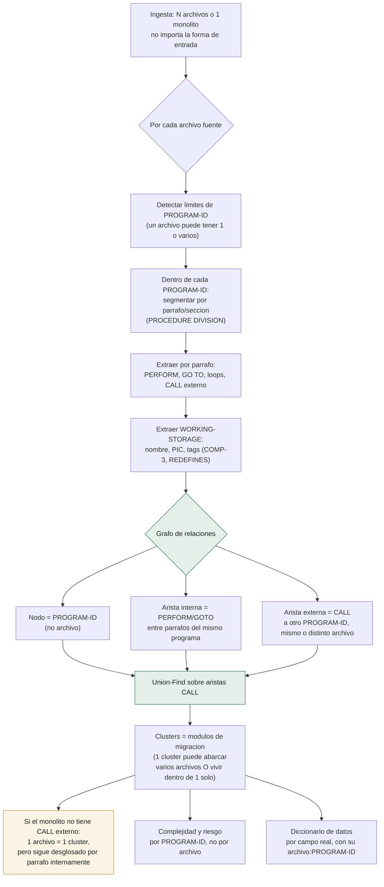

# Relación y secuencia — cómo el agente desglosa el repo origen

Generalizado: funciona igual si el repo trae 50 archivos `.cbl` separados o **un solo script monolítico** — la unidad de descomposición nunca es "el archivo", es la estructura interna real (PROGRAM-ID, párrafos, CALL/PERFORM).



## Pseudocódigo (independiente de archivos)

```
function explore(source_tree):
    programs = []
    for file in source_tree:                     # 1 archivo o 1 solo monolito
        for program_block in split_by_PROGRAM_ID(file.text):
            programs.append({
                id: program_block.program_id,
                origin_file: file.path,           # metadato, no la unidad de trabajo
                paragraphs: split_by_paragraph(program_block.procedure_division),
                variables: extract_PIC_fields(program_block.working_storage),
            })

    # Grafo interno: parrafo -> parrafo (mismo programa)
    for program in programs:
        for paragraph in program.paragraphs:
            for target in find_PERFORM_GOTO(paragraph.body):
                if target in program.paragraphs:
                    add_edge(paragraph, target, kind="internal")

    # Grafo externo: programa -> programa (via CALL), cruza archivos o no
    program_by_id = index(programs, key=id)
    for program in programs:
        for target_id in find_CALL(program):
            if target_id in program_by_id:
                add_edge(program, program_by_id[target_id], kind="external_call")
            else:
                flag_unresolved_call(program, target_id)   # nunca se asume, se marca

    # Clustering: componentes conectados SOLO por CALL externo
    clusters = union_find_over(programs, edge_kind="external_call")
    # Un monolito sin CALL externo -> cada PROGRAM-ID es su propio cluster,
    # pero ya viene desglosado por parrafo desde el paso 1 — nunca se trata
    # el archivo entero como una caja negra.

    for cluster in clusters:
        emit_module(
            members = cluster.programs,
            risk = evaluate(cluster, tags=["COMP-3", "REDEFINES", "HIGH complexity"]),
            data_dictionary = collect_fields(cluster.programs),
            business_rules = draft_or_agentic_extract(cluster),
        )

    return clusters   # esto es "Run exploration" — un grafo, no una lista de archivos
```

## Por qué esto responde al caso "llega un monolito de un solo script"

- La unidad de descomposición es **PROGRAM-ID → párrafo**, no el archivo. Un archivo de 5,000 líneas con 8 `PROGRAM-ID` distintos se separa en 8 nodos igual que si vinieran en 8 archivos.
- Si dentro de eso hay UN solo `PROGRAM-ID` gigante, el desglose sigue funcionando **un nivel más abajo**: por párrafo/sección (`PERFORM`, `GO TO`), generando el grafo interno de control de flujo — nunca se trata el bloque como opaco.
- El clustering final (módulos de migración) se basa en `CALL` real entre `PROGRAM-ID`s, así que un monolito sin llamadas externas simplemente produce un solo módulo — correcto, no un bug (confirmado hoy con el fixture `account_lookup`/`aml_flagging`/`transaction_posting`, que no se llaman entre sí y correctamente no generan aristas).
