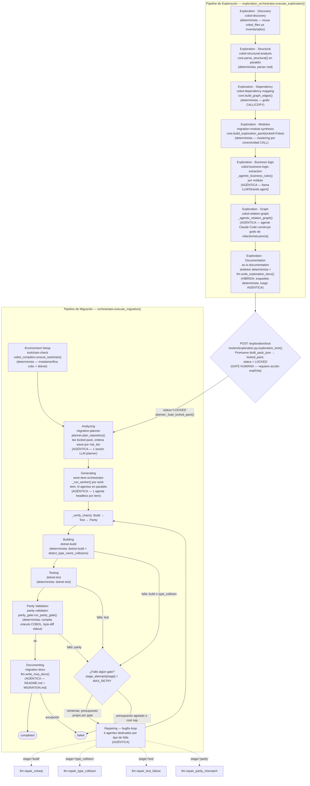

# Arquitectura del flujo agéntico — Cobalt (COBOL→C#)

> Generado leyendo directamente el código en `backend/` (no es una plantilla genérica). Cobertura: `backend/orchestrator.py`, `backend/exploration_orchestrator.py`, `backend/routers/exploration.py`, `backend/planner.py`, `backend/llm.py`, `backend/cobol_compilers.py`.

## 1. Diagrama de flujo

Cobalt tiene dos pipelines secuenciales con un **gate humano** entre ambos: la Exploración (fase 0, opcional pero recomendada) termina en un estado `LOCKED` que la Migración puede leer para priorizar por riesgo.

## 2. Tabla de etapas

| Etapa (nombre real en código) | Módulo / función | Qué hace | Determinista o agéntica |
|---|---|---|---|
| Exploration · Discovery | `exploration_orchestrator.execute_exploration()` | Reutiliza el inventario ya cargado en `cobol_files` (no re-escanea) | Determinista |
| Exploration · Structural | `core.parse_structural()`, invocado en `one_file()` dentro de `execute_exploration()` | Parsea DIVISIONs, variables PIC/COMP, párrafos y CALLs por archivo, en paralelo (`asyncio.Semaphore`) | Determinista |
| Exploration · Dependency | `core.build_graph_edges()` | Construye el grafo de dependencias CALL/COPY entre programas COBOL | Determinista |
| Exploration · Modules | `core.build_exploration_pack(locked=False)` | Agrupa programas en módulos de migración por conectividad CALL | Determinista |
| Exploration · Business logic | `_agentic_business_rules()` (en `exploration_orchestrator.py`) | Reemplaza los stubs de reglas de negocio por extracción real vía agente/LLM (Strands agent), por módulo | Agéntica |
| Exploration · Graph | `_agentic_relation_graph()` | Un agente Claude Code construye un grafo de relación/secuencia sobre el pack | Agéntica |
| Exploration · Documentation | `exploration_documentation.write_as_is_documentation()` + `llm.write_exploration_docs()` | Primero arma un esqueleto determinista y auditable (Tier 1/2), luego lo enriquece con un agente Claude Code headless | Híbrida (esqueleto determinista → enriquecimiento agéntico) |
| Gate: `POST /{run_id}/exploration/lock` | `routers/exploration.py:exploration_lock()` | Promueve `draft_pack_json` existente a `locked_pack`, marca `status='LOCKED'`. **No** re-deriva el pack desde cero (bug corregido: preserva reglas de negocio del agente y notas humanas ya presentes) | Determinista / gate humano |
| Environment Setup | `cobol_compilers.ensure_toolchain()`, llamado en `orchestrator.execute_migration()` | Verifica/instala `cobc` (GnuCOBOL) y `dotnet`; cada comando de instalación se reporta vía `on_step` callback | Determinista |
| Analyzing | `planner.plan_repository()` vía `orchestrator.ensure_plan()` | Sesión única de LLM planner sobre un inventario compacto; si hay pack `LOCKED`, ordena `wave` ascendente por `risk_tier` (`_module_risk_tier`) y reusa `business_rules` verbatim | Agéntica |
| Generating | `orchestrator._run_worker()`, orquestado en el `while True` de `execute_migration()` | Ejecuta hasta `max_agent_slots()` agentes en paralelo, uno por work item, generando C# | Agéntica |
| Building | `_verify_chain()` → `detect_type_name_collisions()` + `_dotnet(["build"], ...)` | Escaneo estático de colisión de tipos (heurístico) y luego `dotnet build` real | Determinista |
| Testing | `_verify_chain()` → `_dotnet(["test", ...])` | Ejecuta `dotnet test`; trata "No test is available" como fallo real pese a exit code 0 | Determinista |
| Parity Validation | `parity_gate.run_parity_gate()` | Compila cada programa COBOL como oráculo, corre el candidato C# con el mismo fixture, byte-diff de salida | Determinista |
| Repairing (bugfix-loop) | `orchestrator.execute_migration()`, diccionario `_REPAIR_FNS` | Repara el gate que falló re-invocando el agente dedicado a ese tipo de falla, con presupuesto `stage_attempts[stage] < MAX_RETRY` independiente por gate | Agéntica |
| — repair "build" | `llm.repair_csharp()` | Corrige errores de compilación `dotnet build` | Agéntica |
| — repair "type_collision" | `llm.repair_type_collision()` (llama `repair_csharp` con `_TYPE_COLLISION_REPAIR_PROMPT`) | Corrige referencias ambiguas a tipos con mismo nombre simple en namespaces distintos, sin fusionar/eliminar tipos | Agéntica |
| — repair "test" | `llm.repair_test_failure()` (prompt `_TEST_REPAIR_PROMPT`) | Corrige fallos de `dotnet test` | Agéntica |
| — repair "parity" | `llm.repair_parity_mismatch()` (prompt `_PARITY_REPAIR_PROMPT`) | Corrige divergencias de comportamiento COBOL-vs-C# detectadas por el byte-diff | Agéntica |
| Documenting | `llm.write_mvp_docs()` | Genera `README.md` y `MIGRATION.md` del proyecto migrado | Agéntica |

## 3. Verificado

Hechos confirmados leyendo el código fuente (no inferidos):

1. **El presupuesto de reparación es independiente por gate, no compartido.** En `backend/orchestrator.py:execute_migration()`, el diccionario `stage_attempts: dict[str, int] = {"build": 0, "type_collision": 0, "test": 0, "parity": 0}` se incrementa solo para el `failed_stage` devuelto por `_verify_chain()`, y el bucle de reparación continúa mientras `stage_attempts[failed_stage] < MAX_RETRY`. El comentario del propio código documenta el defecto real que motivó esto (run `01M2M036AND64G9YQ8WT59TMAB`): un contador compartido agotaba el presupuesto total en dos bugs no relacionados y dejaba cero intentos para un tercero.

2. **El lock de Exploration nunca vuelve a derivar el pack desde cero.** En `backend/routers/exploration.py:exploration_lock()`, la línea `pack = dict(data["draft_pack"])` promueve el `draft_pack_json` existente tal cual a `locked_pack_json` con `status='LOCKED'`. El comentario en el código señala explícitamente que antes se llamaba `core.build_exploration_pack(..., locked=True)`, lo cual regeneraba el pack y descartaba silenciosamente las reglas de negocio ya extraídas por el agente (`_agentic_business_rules`) y las notas humanas cargadas vía `POST .../notes`.

3. **El planner solo lee el pack si `exploration_sessions.status = 'LOCKED'`.** `backend/planner.py:_load_locked_pack()` ejecuta `SELECT draft_pack_json FROM exploration_sessions WHERE run_id = ? AND status = 'LOCKED'`; si no hay fila (exploración nunca corrida o no bloqueada), retorna `None` y `plan_repository()` sigue funcionando sin ese contexto — confirma que el lock es efectivamente el gate humano que habilita el enriquecimiento de Planning, y que Exploration es opcional, no obligatoria.

4. **Los 4 repair functions son un único motor con prompts distintos.** `backend/llm.py` define `repair_type_collision`, `repair_test_failure` y `repair_parity_mismatch` como llamadas delgadas a `repair_csharp(target_dir, errors, timeout_s, on_progress, prompt_template=...)`, cada una pasando su propio `_TYPE_COLLISION_REPAIR_PROMPT` / `_TEST_REPAIR_PROMPT` / `_PARITY_REPAIR_PROMPT`; solo `repair_csharp` invoca realmente el binario `claude` (`find_claude()`) vía subprocess con `--dangerously-skip-permissions`.
