# Flujo agéntico de Cobalt — estado real, actualizado hoy

```mermaid
flowchart TD
    A["Intake<br/>.zip o repo_url"] --> B["Environment Setup<br/>ensure_toolchain: cobc + dotnet<br/>instala si falta, supervisado"]
    B --> C["Exploration (subsistema aislado)<br/>propio DB table, propio router"]

    subgraph EXPL["Exploration — determinista + agentico"]
        direction TB
        C1["Structural parse<br/>PROGRAM-ID, PIC, parrafos<br/>paralelo por archivo"]
        C2["Dependency graph<br/>CALL edges, union-find"]
        C3["Module clustering<br/>+ data dictionary real"]
        C4["Business rules<br/>AGENTE REAL reemplaza stubs<br/>(Strands/claude -p)"]
        C1 --> C2 --> C3 --> C4
    end
    C --> EXPL
    EXPL --> D{"Human Lock<br/>revision + notas"}
    D --> E["Planning<br/>1 llamada LLM, ahora lee<br/>el pack bloqueado: risk_tier + reglas"]
    E --> F["Generating<br/>1 agente headless aislado<br/>por work item, paralelo"]
    F --> G{"Verify Chain"}

    subgraph VERIFY["Verify Chain — cada gate con su propio presupuesto de retry"]
        direction TB
        G1["Type-collision scan<br/>estatico, reconoce alias, sin dotnet"]
        G2["dotnet build"]
        G3["dotnet test"]
        G4["Parity Gate<br/>GnuCOBOL oraculo vs C#<br/>byte-diff real"]
        G1 -->|limpio| G2 --> G3 --> G4
    end
    G --> VERIFY
    VERIFY -->|falla cualquier gate| R["Repair agent dedicado por tipo<br/>repair_type_collision / repair_csharp<br/>/ repair_test_failure / repair_parity_mismatch"]
    R --> VERIFY
    VERIFY -->|3/3 match| H["Documenting<br/>README numerado + instalacion real<br/>docs/MIGRATION.md"]
    H --> I["PASSED<br/>artifact.zip / GitHub push"]

    style B fill:#e4efe9,stroke:#1f6f5c,color:#1c2321
    style EXPL fill:#f6f4ef,stroke:#5a655f,color:#1c2321
    style C4 fill:#f6e9df,stroke:#b3541e,color:#1c2321
    style D fill:#fbf3e4,stroke:#c8932e,color:#1c2321
    style VERIFY fill:#f6f4ef,stroke:#5a655f,color:#1c2321
    style G1 fill:#e4efe9,stroke:#1f6f5c,color:#1c2321
    style G4 fill:#e4efe9,stroke:#1f6f5c,color:#1c2321
    style R fill:#f6e9df,stroke:#b3541e,color:#1c2321
    style I fill:#e4efe9,stroke:#1f6f5c,color:#1c2321
```

## Qué cambió hoy respecto a la versión anterior de este diagrama

| Etapa | Antes | Ahora |
|---|---|---|
| Environment Setup | No existía | Nueva, primera etapa — instala cobc/dotnet real si faltan, todo logueado |
| Exploration | No existía como fase separada | Subsistema aislado completo: parse determinista + agente real de reglas de negocio |
| Human Lock | No existía | Revisión humana del pack antes de Planning, con notas por módulo |
| Planning | 1 llamada LLM ciega | Ahora lee el pack bloqueado — ordena `wave` por riesgo, reusa reglas ya extraídas |
| Type-collision scan | No existía | Estático, detecta ambigüedad de tipos antes de gastar un build real, reconoce alias de C# |
| Repair agents | 1 genérico | 4 dedicados por tipo de fallo, cada uno con su propio prompt y presupuesto |

## Verificado real hoy (no simulado)

- Run `01M2NN5Q765RDGP4ZCV1Q6WC4H`: **PASSED**, 3/3 parity, build 0 errores, test 21/21 — corrido de punta a punta sin intervención manual en el loop de reparación.
- README generado: seguido literal en shell 100% limpio (`env -i`, HOME aislado) — build y test reales pasan.
- Fase 2 agéntica de Exploration: 21 reglas de negocio reales extraídas (no genéricas) en un run distinto, $0.031 de costo real.
