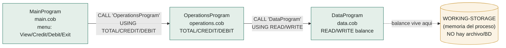
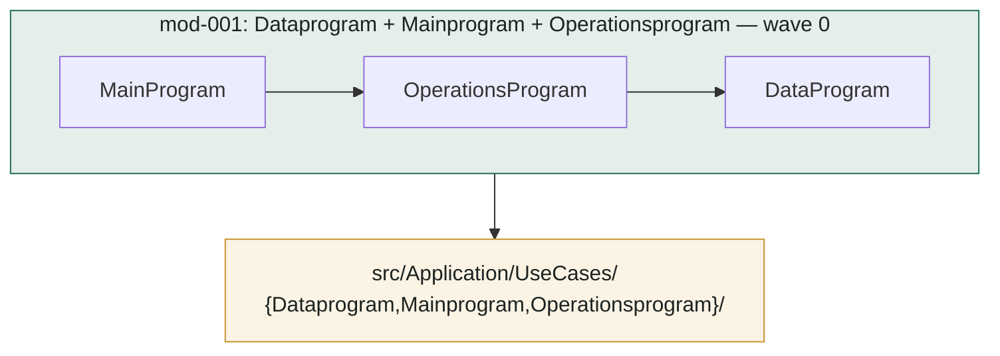
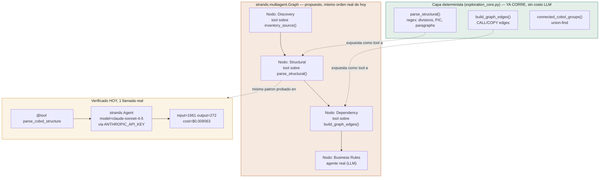

# Arquitectura real — run `01M2NTWGMWX1ERNRQ9AMT8BG2M`

Datos reales extraídos por el subsistema de Exploración (determinista, sin LLM) contra `cobol-accounting-system`. Sin base de datos ni archivos: `DataProgram` guarda el balance en `WORKING-STORAGE` (memoria del proceso), no hay `SELECT`/`FD`/`EXEC SQL` en ninguno de los 3 programas.

## 1. Grafo CALL real (COBOL original)

**Orden topológico real** (calculado por `exploration_core.build_graph_edges`): `main.cob → operations.cob → data.cob`.

## 2. Clustering en módulo de migración

Los 3 programas están conectados por CALL, así que el subsistema de Exploración los agrupa en UN solo módulo (union-find sobre el grafo — `work_items.connected_cobol_groups`):

11 business rules draft generadas (3 CALL sites × repetición por rama de menú + 2 GOBACK) — determinista, sin LLM todavía.

## 3. Capa agéntica — Multi-Agent Graph con Strands (experimento verificado hoy)

**Siguiente iteración** (no ejecutada, pendiente tu confirmación por costo): construir el `Graph` de 4 nodos completo con `GraphBuilder` de Strands, mismo orden que `exploration_orchestrator.py` ya corre hoy en `asyncio.gather` manual, pero con orquestación declarativa.

## Resumen de infraestructura de este run

| Componente | Real hoy |
|---|---|
| Base de datos | **Ninguna** — balance en memoria, sin `SELECT`/`FD`/`EXEC SQL` |
| Persistencia | Ninguna en el COBOL original; el C# migrado sí necesitará decidir dónde persistir (gap a resolver en Architecture Proposal) |
| Grafo CALL | 2 edges reales, 3 programas, 1 módulo de migración |
| Capa agéntica activa | Exploración = determinista (gratis); Planning = 1 llamada LLM (`llm.plan_manifest`); Generating = 1 agente headless por work item |
| Strands | Instalado y verificado con 1 llamada real ($0.009), Graph completo no wireado a producción todavía |
